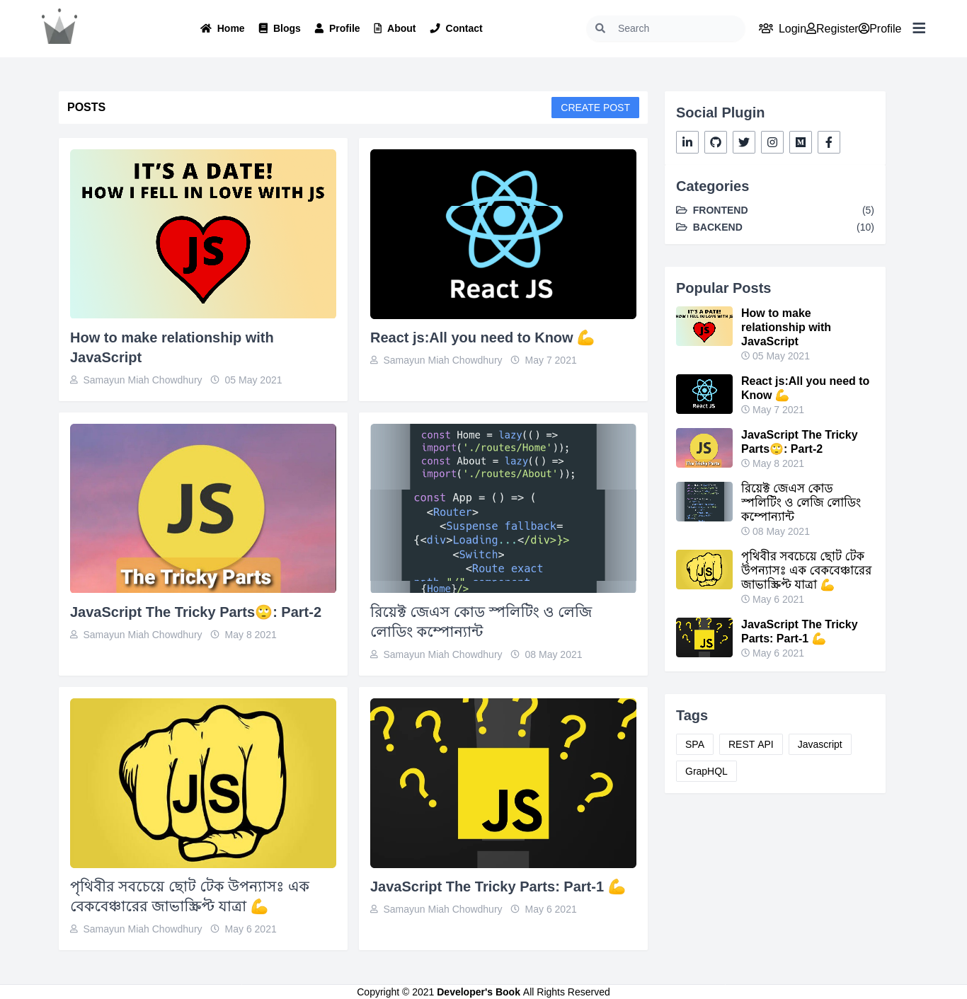

<h2 align="center"> Developer's Book Blog Application </h2>

<p align="center">      
       </br>
</p>

  * API : [Developer's Book GraphQL Playground](https://developersbook.vercel.app/api/graphql)

  * Demo : [Developer's Book Live Site](https://developersbook.vercel.app)

## Homepage

## Documentation

* [How to work with multiple branch or team collaboration](docs/multile-branch-team-collaboration-guideline.md)

* [How to Setup Prisma GrapHQL & Next.js Application ](docs/how-to-setup-graphql-prisma-nextjs-app.md)
* [ GraphQL Queries & mutations ](graphql/Readme.md)

## How to run this project
 * Clone first `git clone https://github.com/samayun/samayun-sayburgh-backend-task.git samayun-sayburgh-backend-task`
 * `cd samayun-sayburgh-backend-task`
 * run command `npm install` 
 * rename file `.default.env` to `.env` & must include database string on ENVIRONMENT VARIABLES
```
  DATABASE_URL  = DATABASE_CONNECTION_STRING_for_production

  JWT_SECRET_KEY=SECRET

```
 * run command `npm run dev`
 * browse: http://localhost:3000 for seeing main application views
 * browse to api query by GraphiQL: http://localhost:3000/api/graphql
# Features
* User can create blog
* anyone can view blogs
* user can update own blog
* user can delete own blog
  on Going :smile: ,
* user could clap for blog
* user could comment create , edit & delete for a blog.
* rich text edited blog
* admin can manage  everything

# Technical Features
* GraphQL Server which gives a flexible way to query/exchange data between server & client
* MVC Design Pattern implemented for easy mangement
* Prisma used for flexible Database Query. If team decides to change Database no need to change any codes just change the DB_CONNECTION_STRING from Hosted Server's ENVIRONMENT_VARIABLE
* Batch Query for optimize fetching data
*  I have handled token based authentication by JWT
* 2 Tier Architecture .Application & API server hosted on a server for low cost & DB server hosted on different server.
* MVC Design PAttern implemented
* Authentication Header verified on both side (Client & bServer Side )
* User can create blog, read others blog update own blog & delete own blog
* User can see his/her profile
* Data managed via GraphQL. Here is that playground  . You can query & mutate following this documentation
* Frontend managed via Next.js. Because a blog app should be SEO friendly. Next.js is a good solution for this. Auto code splitting , lazy loading, image progressive loading is implemented by default. 
# Used Technologies

Backend [API SERVER URI http://localhost:3000/api/graphql ]
*  Language : Node.js
*  Framework : Express.js ( express-graphql wrapper )
*  ORM : Prisma
*  Database : MongoDB

Frontend

*  Language : JavaScript
*  Framework : NEXT.js ( express-graphql wrapper )
*  UI component Library/framework : Tailwind CSS
*  State Mangement : Apollo
  